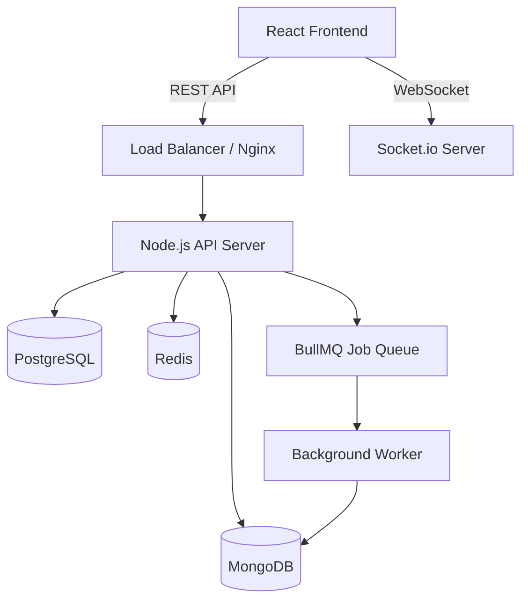

# Real-Time Collaborative Workspace

A production-grade full-stack application for real-time code collaboration, featuring secure authentication, workspace management, live coding with cursor tracking, and asynchronous job processing.

## Tech Stack

### Backend
*   **Runtime:** Node.js, TypeScript
*   **Framework:** Express.js (Clean Architecture)
*   **Databases:** 
    *   **PostgreSQL** (Prisma ORM) - Relational data
    *   **MongoDB** (Mongoose) - Logs & Job history
    *   **Redis** - Caching, Rate Limiting, Pub/Sub, Queues
*   **Real-Time:** Socket.io (with Redis Adapter)
*   **Async Jobs:** BullMQ
*   **Docs:** Swagger/OpenAPI

### Frontend
*   **Framework:** React 18 (Vite, TypeScript)
*   **Styling:** Tailwind CSS v4
*   **State Management:** TanStack Query (React Query)
*   **Editor:** Monaco Editor (VS Code core)
*   **Infrastructure:** Nginx (Production serving)

## Features

1.  **Authentication & Security**:
    *   JWT Access + Refresh Tokens.
    *   Role-Based Access Control (Owner, Collaborator, Viewer).
    *   API Rate Limiting & Helmet Security Headers.
2.  **Workspace Management**:
    *   Create and manage Workspaces and Projects.
    *   Invite members via email.
3.  **Real-Time Collaboration**:
    *   Live code editing (broadcast changes).
    *   User presence (join/leave notifications).
    *   Scalable architecture using Redis Adapter.
4.  **Code Execution System**:
    *   Async job submission via API.
    *   Background processing with BullMQ workers.
    *   Real-time status polling.

## Quick Start (Docker)

The easiest way to run the full application is using Docker Compose.

1.  **Clone the repository**:
    ```bash
    git clone <repo-url>
    cd purple-merit
    ```

2.  **Start the services**:
    ```bash
    docker-compose up --build -d
    ```
    This will spin up Postgres, MongoDB, Redis, Backend API, and Frontend App.

3.  **Access the application**:
    *   **Frontend**: `http://localhost:80` (or just `http://localhost`)
    *   **Backend API**: `http://localhost:3000`
    *   **API Documentation**: `http://localhost:3000/api/docs`

## Local Development Setup

If you prefer to run services locally:

### Prerequisites
*   Node.js v25+
*   PostgreSQL, MongoDB, Redis running locally.

### Backend
1.  Navigate to root: `cd .`
2.  Install dependencies: `npm install`
3.  Setup Env: Create `.env` (copy defaults from `.env.example`).
4.  Run Migrations: `npx prisma db push`
5.  Start Dev Server: `npm run dev`

### Frontend
1.  Navigate to frontend: `cd frontend`
2.  Install dependencies: `npm install`
3.  Start Dev Server: `npm run dev`
4.  Open `http://localhost:5173`

## Architecture



## Testing

Run integration tests for the backend:
```bash
npm test
```